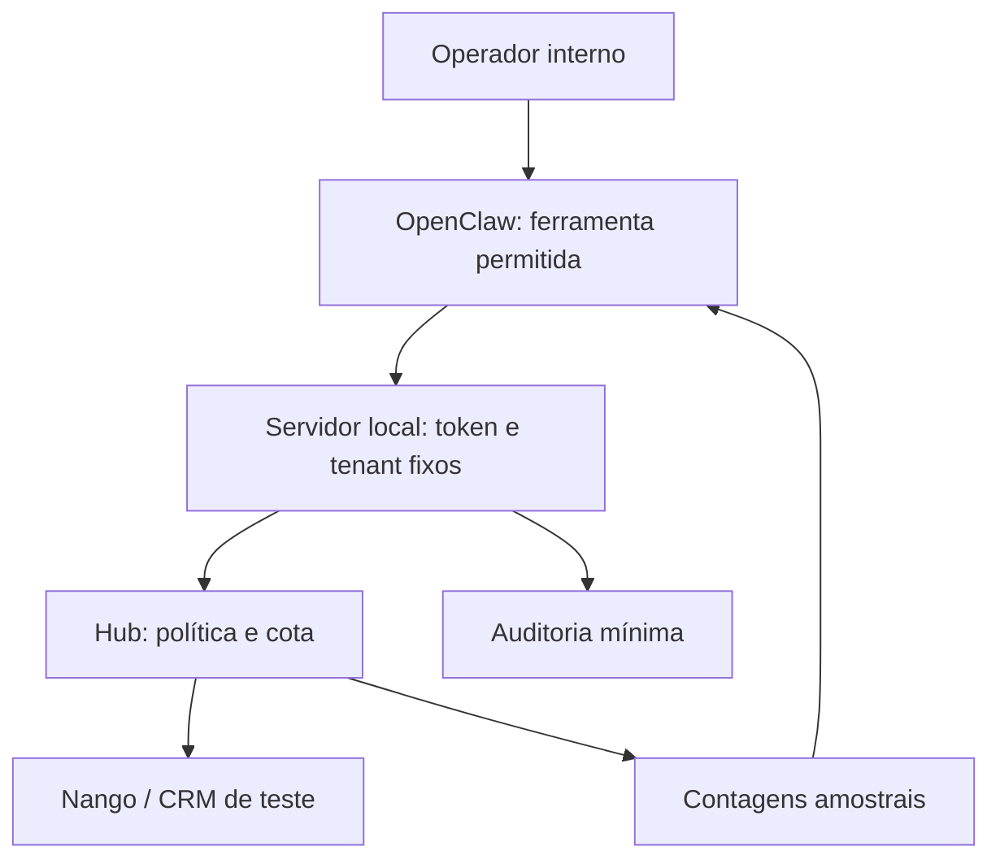

# Piloto OpenClaw / Radar

Responsável: Carlos Felipe (`ofelipepeixoto`). Estado: implementação original em laboratório, somente leitura. Referência upstream: OpenClaw `2026.9.7`, SHA `c074824a27c96d3983043f9eeb33823cd1772d8c`.

## O que está pronto

`radar_crm_preview` chama exclusivamente `POST /v1/crm/deals/preview` no servidor local. Esse POST consulta dados: não modifica o CRM. Entrada HTTP: somente `requestId`. O servidor autentica token de serviço e constrói tenant e ação a partir de configuração confiável. O domínio reserva a tentativa antes da chamada Nango e limita a amostra a 10 registros. A ferramenta filtra o retorno para contagens, `hasMore` e `sample-only`.

HTTP local real e contratos foram testados com dados fictícios. O entrypoint que importa `definePluginEntry` segue o SDK público observado; o loader, registro efetivo, seleção pelo modelo e ferramentas disponíveis no Gateway ainda não foram executados.



## Demonstração reproduzível

```bash
npm test
npm run demo:openclaw
```

A demonstração usa token aleatório em memória e diretório temporário. Fecha o servidor e remove esse diretório. Não consome a cota `.state/` do operador, não requer OpenClaw e não faz chamada externa.

## Serviço local persistente

Use um segredo aleatório de pelo menos 32 bytes codificado em base64url (43 caracteres ou mais), fornecido por variável de ambiente/gerenciador de segredos. O código valida formato e comprimento, não a entropia real. Não colocar o valor em chat, prompt, código, argumento do modelo ou arquivo versionado.

Configure no backend `RADAR_SERVICE_TOKEN` e `RADAR_TENANT_ID`. Para dados fictícios, execute `npm run serve:readonly`. O listener é fixo em `127.0.0.1:8787`; não há configuração de bind público. A ausência de token aborta a inicialização. A cota fica em `.state/` e permanece após recriar o servidor.

O modo real é explícito: `npm run serve:readonly -- --live`. Requer `NANGO_SECRET_KEY`, `NANGO_PROVIDER_CONFIG_KEY` e `NANGO_CONNECTION_ID` no processo backend. Pode gerar custos; não foi executado nesta entrega. Não fornecer essas variáveis ao processo OpenClaw.

No processo OpenClaw, configure apenas o token de serviço do Hub e, se necessário, `RADAR_HUB_ENDPOINT`, restrito por código à rota em `http://127.0.0.1`. O segredo de operador do Gateway é separado e não deve ser entregue ao chamador do Hub. Reiniciar os processos após rotação do token; não há revogação dinâmica por usuário nesta versão.

## Homologação do plugin no host de teste

O host deve usar a release de referência e runtime suportado por ela: Node `>=24.16.0 <25` ou `>=26.1.0`. O Hub isolado continua compatível com Node 22.13+ conforme sua CI; isso não significa que o Gateway também seja.

Com serviço sintético ativo e ambiente do host preparado, instalar a pasta de desenvolvimento:

```bash
openclaw plugins install --link ./plugins/openclaw-radar
openclaw plugins enable radar-hub-readonly
openclaw plugins inspect radar-hub-readonly --runtime --json
```

Não executar `npm install` na pasta de plugin para rodar os testes do Hub: o peer OpenClaw é fornecido pelo host. Revisar código e política de instalação; as políticas locais podem bloquear instalação. Não desativar políticas para fazer o teste passar.

No agente exclusivo do piloto, permitir somente `radar_crm_preview`; revisar o inventário efetivo para confirmar que shell, browser, envio, publicação e outras ferramentas não estão acessíveis. Habilitar o plugin não remove as outras ferramentas de uma configuração preexistente. A lista de plugins deve conservar somente os provedores/runtime confiáveis necessários mais este adaptador. Verificar o runtime ativo, não apenas a configuração salva.

O teste de aceite do host deve provar: carregamento do entrypoint; ferramenta na allowlist; consulta sintética com escopo amostral; replay recusado; tentativa de trocar tenant/URL recusada; timeout; token incorreto; indisponibilidade; ausência de token/nomes no contexto e logs. Depois, repetir em um CRM de teste com OAuth real. Nenhuma conta foi conectada nesta etapa.

## Fronteira e limites

O servidor aceita um único tenant interno e uma credencial de serviço. Não autentica pessoas individualmente. O OpenClaw e seu plugin são processos confiáveis do operador e possuem o token limitado do Hub; não recebem a chave Nango. Loopback reduz exposição de rede, mas não separa processos adversariais no mesmo host. Containers distintos não compartilham loopback: a topologia deve ser validada antes de deployment; não ampliar o bind como correção automática.

Uma reserva local e lock de diretório não oferecem transações distribuídas. O lock pode permanecer após crash; a cota renova no dia UTC; o ledger guarda tentativas daquele dia, não histórico permanente de auditoria. Replay de chamada já executada é recusado, sem retornar o resultado anterior. Logs de auditoria são eventos mínimos em stdout e precisam de retenção controlada pelo operador. Cota de tentativas do CRM não limita gastos do LLM no OpenClaw, Nango, outros processos ou conta inteira.

O plugin não usa modelo específico nem contrata serviço. Limitar orçamento, tokens, iterações e tempo no host antes de usar LLM. Não há benchmark, E2E Gateway, scan transitivo, carga, deployment, MCP remoto ou aprovação para escritas comprovados. O piloto não habilita WhatsApp nem substitui a Cloud API oficial.

## Decisão de produto

Primeira hipótese: a equipe consegue preparar um resumo amostral CRM com menos trabalho e mesmo nível de correção do caminho determinístico. Comparar tarefas iguais, medir minutos humanos e custo por resultado aceito. Dados fictícios e testes de contrato não comprovam demanda ou economia. Manter em **EXPERIMENT** até concluir homologação e medir utilidade; iterar antes de SaaS/escala.

## Origem

Código do adaptador e servidor é original Carlos Felipe/Radar. OpenClaw Foundation conserva a autoria do host/SDK MIT e Nango Inc a de seu componente externo ELv2. Consultar `NOTICE.md` e `AUTORIA.md` antes de reutilizar código, ativos ou marca.
