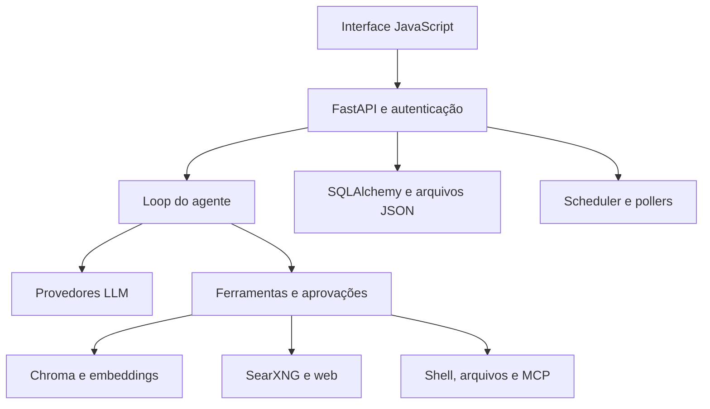
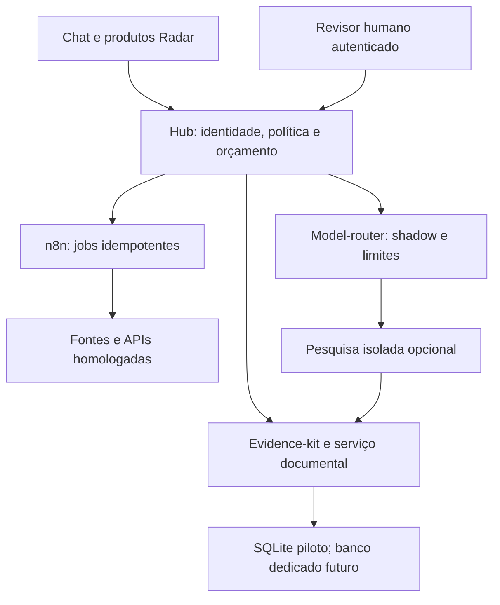

# Auditoria técnica — Odysseus no ecossistema Radar / Help Mídias

**Data:** 4 de outubro de 2026. **Modo:** `AUDIT_AND_RECOMMEND`.
**Alvo:** [odysseus-dev/odysseus](https://github.com/odysseus-dev/odysseus), branch padrão `dev`, commit auditado `2992bf6d368a11472323e47d3bfed91e79cefc6b`.
**Autor da análise:** assistência de engenharia para Carlos Felipe Peixoto. Os componentes upstream mantêm seus autores e licenças.

## 1. Executive Summary

**Decisão principal: B — STUDY.** O Odysseus merece estudo por reunir pesquisa, chat, RAG, ferramentas, aprovações, tarefas, e-mail e MCP em uma aplicação funcional. Não recomendo colocá-lo agora no VPS compartilhado nem transformá-lo em backend multiempresa. A integração futura de um trabalhador de pesquisa separado é uma hipótese, condicionada a avaliação, isolamento e licença; não é uma adoção aprovada nesta auditoria.

[CODE VERIFIED] Há proteções reais: autenticação com bcrypt/TOTP, autorização de ferramentas por papel, aprovações vinculadas à ação, validação de URLs, filtros por proprietário e CI ampla. [TEST VERIFIED] Foram executados localmente **145 testes upstream**, **52 testes do seu Hub** e **3 regressões do patch proposto**, todos aprovados; os logs da CI do mesmo commit registram **5.945 aprovados e 11 ignorados**. Esses conjuntos têm escopos diferentes e não devem ser somados como cobertura independente do produto.

Os principais limites para seu caso são: perda de proveniência quando duas fontes do mesmo proprietário têm texto igual; leitura interna de todos os proprietários no fallback lexical; shell com autoridade de sistema operacional; migrações legadas específicas de SQLite; ausência, no caminho examinado, de reserva financeira persistente e de isolamento organizacional suficiente para SaaS. O patch entregue reduz o segundo problema, mantendo o filtro de saída existente; não corrige os demais.

Seu caminho de menor complexidade é fortalecer **radar-integration-hub + radar-evidence-kit + assistente-documental-ia + radar-model-router**, usando o n8n já existente. Isso desenvolve autoria própria em contratos de evidência, governança e avaliação, preservando atribuição quando utilizar software externo.

## 2. GitHub Ecosystem Context

[CODE VERIFIED — inventário API] Foram encontrados **15 repositórios acessíveis** em `ofelipepeixoto`: 14 públicos e `radar-n8n-projetos` privado. Foram lidos os READMEs dos 15, clonados 10 projetos próprios para inspeção dirigida e lidos arquivos operacionais do projeto n8n. Isso é um mapa do conjunto acessível, não auditoria completa de cada linha dos 15 projetos. Os commits dos 10 clones estão em `snapshot-manifest.json`.

| Repositório | Papel observado | Implicação para Odysseus |
|---|---|---|
| `radar-integration-hub` | Governança, propostas, reservas financeiras SQLite, integração CRM e adaptador OpenClaw | Ponto de integração e autorização; reutilizar |
| `radar-evidence-kit` | Contratos de fonte, hashes, revisão e evidência documental | Base de proveniência; reutilizar |
| `assistente-documental-ia` | Processamento PDF e revisão documental; OCR opcional | Manter ingestão documental especializada |
| `laboratorio-busca-rag` | Baseline lexical, testes e trilha opcional pgvector | Comparar retrieval, sem segundo laboratório equivalente |
| `avaliacao-rag-juridico` | Avaliação lexical e casos reservados | Incorporar critérios de avaliação antes de integração |
| `radar-model-router` | Política estática em modo shadow; uso pago desabilitado | Governar roteamento e custo fora do trabalhador |
| `skill-revisao-de-fontes` | Validação estrutural de relatórios e fontes | Complemento de revisão; não comprova a verdade das fontes |
| `agente-aprovacao-humana` | Exemplo didático de aprovação em memória | Não usar como autorização de produção |
| `radar-oaas` | Produto Astro/React, regras determinísticas e IA opcional | Consumidor futuro de serviços governados |
| `hermes-leilao-rj` | Aplicação Next/React/Vite com domínio de leilões | Separar pesquisa de qualquer execução de lance |
| `radar-n8n-projetos` | Workflows e documentação da infraestrutura existente | Orquestração externa; evitar duplicar instalação |
| `LibreChat` | Aplicação conversacional upstream, segundo README | Sobreposição relevante de interface/chat |
| `TradingAgents` | Agentes financeiros upstream, segundo README | Referência; não conectar execução financeira automaticamente |
| `radar-video-studio` | Base MoneyPrinterTurbo, segundo README | Fora do piloto de pesquisa; preservar autoria upstream |
| `ofelipepeixoto` | Perfil e posicionamento | Exibir resultados e autoria com evidências |

[DOC CLAIM] Documentos selecionados de execução e auditoria n8n foram confrontados com `docs/ambiente.md` atual. As proteções recentes registradas no repositório substituem diagnósticos históricos anteriores. [NOT VERIFIED] Não houve inspeção SSH da máquina, nem execução de workflows ativos nesta sessão.

## 3. Repository Overview

[CODE VERIFIED] O projeto é um workspace agentic de propósito amplo. A unidade operacional é a aplicação Python/FastAPI, com interface JavaScript e serviços auxiliares. Ele integra conversas e sessões, modelos e provedores, busca/pesquisa, memória/RAG, arquivos, terminal/Python, MCP, tarefas, e-mail, calendário e notificações.

| Camada | Evidência no snapshot |
|---|---|
| Entrypoint/API | `app.py`, routers em `routes/`, FastAPI/Uvicorn |
| Agente/LLM | `src/agent_loop.py`, `src/llm_core.py`, `src/agent_tools/` |
| Banco | SQLAlchemy; SQLite padrão; DSN PostgreSQL configurável |
| Autenticação | `core/auth.py`, sessões e configurações em arquivos JSON |
| RAG | `src/rag_vector.py`, Chroma, embeddings locais e lanes |
| Tarefas | Scheduler e pollers no processo, com flags para desabilitá-los |
| Busca/notificações | SearXNG e ntfy |
| Frontend | `app.js` e módulos em `static/js/`; não exige React/Next |
| Segredos | `src/secret_storage.py`, criptografia Fernet com chave local |
| Ferramentas | Shell/Python, arquivos, web, e-mail/calendário e clientes MCP |
| Deployment | Dockerfile, Compose, workflows de CI/publicação |

[CODE VERIFIED — contagem] A árvore contém cerca de 1.159 arquivos Python, incluindo testes, e 829 arquivos `test_*.py`; há 178 arquivos JavaScript incluindo terceiros. Essas contagens ilustram superfície de manutenção; não equivalem a cobertura de auditoria. A API de releases consultada retornou lista vazia. O snapshot deve ser fixado pelo SHA, independentemente da ausência de release nessa consulta.

## 4. Evidence Level

As etiquetas seguem o seu prompt: **[CODE VERIFIED]** leitura direta de código; **[TEST VERIFIED]** comportamento demonstrado por execução ou log confiável de teste; **[DOC CLAIM]** declaração documental; **[INFERENCE]** conclusão técnica sem demonstração completa; **[NOT VERIFIED]** informação não confirmada.

| Verificação | Resultado e limite |
|---|---|
| Clonagem e SHA upstream | Commit `2992bf6…`, branch `dev` |
| Compilação Python | `compileall` aprovado em app/core/routes/src/services/scripts/tests |
| Sintaxe JS | `node --check` em 166 arquivos de app/módulos, sem erros |
| Suite upstream local dirigida | 145 aprovados; 1 aviso de depreciação SQLAlchemy |
| CI upstream do mesmo SHA | 5.945 aprovados, 11 ignorados, 8 avisos; Python 3.11.16 |
| Hub local | 52 aprovados: governança, observabilidade e runtime |
| Reproduções sintéticas | Cinco limitações demonstradas; detalhes abaixo |
| Patch | `git apply --check` aprovado; aplicado em worktree isolada; 3 regressões aprovadas |
| Dependências da venv | `pip check` aprovado para ambiente parcial de testes |
| Docker/build/E2E | Não executados; Docker indisponível no ambiente |
| Serviços reais | Sem LLM pago, Chroma real, PostgreSQL real, SMTP, CalDAV, n8n ativo ou carga concorrente |

Os 11 arquivos da suite local cobrem URLs, endpoint chat, aprovações simples e por tarefa, prompt security, fallback RAG/owner, serviço shell, workspace, revogação de sessão e autoridade de token API. Foram utilizados mocks e dados sintéticos. A primeira coleta falhou por ausência de NumPy na venv parcial; após instalar a dependência, a suite passou. Isso é ajuste do ambiente de auditoria, não falha atribuída ao produto.

**CI identificada:** run [36955024798](https://github.com/odysseus-dev/odysseus/actions/runs/36955024798), job Python `110675988054`. Os logs foram consultados; a suite completa não foi repetida localmente. CodeQL e publicação Docker do mesmo SHA apresentaram status de sucesso; não foi inferida ausência de CVEs desse status.

Reproduções em `reproduce_audit.py`: `RAG_SOURCE_COLLAPSE`, `RAG_SCAN_ALL_OWNERS`, `DNS_VALIDATION_NOT_PINNING`, `POSTGRES_MIGRATION_SKIPPED`, `SHELL_CWD_NOT_SANDBOX`. A reprodução DNS verifica a separação validação/conexão, **sem exploit de rede**; a migração é executada por extração AST, **sem PostgreSQL real**; o shell lê somente um arquivo sintético fora do diretório de trabalho.

## 5. License & IP

[CODE VERIFIED] `LICENSE` contém GNU AGPL v3 e o README declara **AGPL-3.0-or-later**. A licença não é MIT. Comentários antigos em requisitos/agradecimentos ainda usam linguagem de núcleo permissivo/MIT; isso é inconsistência documental, não autorização para ignorar a licença vigente. [CODE VERIFIED] Há componentes adaptados com atribuições e licenças próprias, incluindo opencode/llmfit sob MIT e trabalho derivado de Tongyi DeepResearch sob Apache-2.0, além de ativos de terceiros.

[CODE VERIFIED — licença] A AGPL permite uso comercial sujeito às suas condições. Ao disponibilizar pela rede uma versão modificada, a seção 13 trata da oferta do código-fonte correspondente aos usuários que interagem com ela. Distribuição também exige cumprir as disposições aplicáveis. Não se deve remover avisos nem alegar autoria integral de um fork.

[INFERENCE] Usar um serviço separado pode reduzir acoplamento e facilitar delimitar componentes; uma API HTTP não estabelece, por si, que toda combinação estará fora do alcance do copyleft. Para um produto fechado, a composição concreta e as modificações exigem análise da licença antes de comercializar. O download das páginas GNU pelo mecanismo de pesquisa falhou nesta sessão; a verificação material da licença foi feita no arquivo do snapshot, não em uma opinião jurídica externa.

**Estratégia de autoria:** escrever contratos, adaptadores e avaliações originais nos seus projetos; atribuir bibliotecas e soluções upstream. O patch entregue altera código AGPL e deve manter essa licença e seus avisos quando aplicado/distribuído. `radar-integration-hub` e `radar-evidence-kit` têm licença MIT nos snapshots examinados. `avaliacao-rag-juridico` declara `UNLICENSED`: não presumir MIT. O router preserva atribuição MIT de política de terceiros. Projetos derivados como LibreChat/TradingAgents/video não se tornam integralmente originais por mudar o nome.

## 6. Architecture Review

[CODE VERIFIED] O projeto funciona como um monólito modular amplo, ainda com concentração significativa. `src/agent_loop.py` tem aproximadamente 6.455 linhas, `routes/email_routes.py` 6.152, `src/llm_core.py` 3.730, `core/database.py` 2.737. Existem separações `core/routes/src/services`, mas não fronteiras operacionais autônomas equivalentes para cada domínio.

[INFERENCE] Essa arquitetura facilita um workspace pessoal, mas combina autoridade de ferramentas, dados e execução em uma mesma zona de confiança. Não há justificativa para migrar tudo a microserviços agora. A separação valiosa é entre API, execução perigosa e jobs persistentes quando houver demanda real.

O seu Hub já estabelece uma fronteira de governança independente. O Odysseus, se aprovado em piloto, deve entrar como trabalhador subordinado de pesquisa, com contratos de entrada/saída e sem autoridade para publicar, enviar mensagens, gastar ou alterar infraestrutura sozinho.

## 7. Code Quality

[CODE VERIFIED] Há validações, módulos de segurança dedicados, testes de regressão numerosos, clientes compartilhados e publicação atômica de arquivos. O commit auditado corrige publicação de arquivos de corpo vazio de maneira atômica. Isso demonstra manutenção ativa do código, sem garantir estabilidade de todas as funcionalidades.

As dívidas mais relevantes são módulos grandes, dependências parcialmente sem versão fixa, caminhos duplicados de execução de subprocesso e migrações artesanais misturadas com acesso a dados. O projeto não precisa incorporar sua stack frontend para funcionar; reescrever a interface em React teria custo sem benefício demonstrado.

[CODE VERIFIED + TEST VERIFIED] `_migrate_add_last_message_at_column` trata `DATABASE_URL` como caminho SQLite: remove `sqlite:///`, chama `os.path.exists` e retorna quando um DSN PostgreSQL não é um arquivo. Isso demonstra que essa migração legada não migra um banco PostgreSQL existente. Não demonstra que a criação inicial de todo o esquema PostgreSQL falhe.

Refactorings úteis: isolar adaptadores de provedor da política de retry/timeout; centralizar executor de subprocesso com limites; extrair contratos de ferramenta do loop; migrar esquema com versionamento e teste SQLite/PostgreSQL. Faça cada mudança acompanhada de uma regressão de comportamento concreto, evitando um refactoring integral antes de avaliar o produto.

## 8. Security Audit

| Tema | Evidência | Avaliação |
|---|---|---|
| Login/sessões | [CODE VERIFIED] bcrypt, TOTP, backup codes, revogação e gravação atômica | Boa base para workspace; não prova autenticação organizacional |
| Autoridade de ferramentas | [CODE VERIFIED + TEST VERIFIED] restrições admin e token/sentinel | Testes dirigidos passaram; manter menor privilégio |
| Aprovações | [CODE VERIFIED + TEST VERIFIED] IDs opacos, TTL, ação/owner/workspace vinculados e consumo único | Úteis; estado em memória não é trilha durável de negócio |
| Prompt injection | [CODE VERIFIED + TEST VERIFIED] conteúdo externo separado/encapsulado | Defesa parcial; modelo ainda pode ser influenciado |
| URLs de chat | [CODE VERIFIED + TEST VERIFIED] validação pública em `webhook_routes.py` | A alegação antiga de URL privada irrestrita no threat model está desatualizada |
| DNS entre validação e uso | [CODE VERIFIED] validador retorna URL; HTTPx de LLM não fixa IP validado | [INFERENCE] risco residual de DNS rebinding em endpoint configurável não confiável |
| Webhooks de saída | [CODE VERIFIED] transporte com IP fixado e sem seguir redirects | Proteção específica; não generalizar o problema de LLM aos webhooks |
| Shell/Python | [CODE VERIFIED + TEST VERIFIED] processo com acesso do usuário do SO | `cwd` não é sandbox; leitura fora de workspace sintético demonstrada |
| Segredos | [CODE VERIFIED] Fernet e chave no mesmo volume de dados | Protege extração isolada do armazenamento; não processo comprometido/backup completo |
| Tenancy | [CODE VERIFIED] owner em registros, sem políticas organizacionais RLS encontradas no caminho auditado | Não suficiente para multiempresa regulado |

**SSRF:** em `routes/webhook/webhook_routes.py`, a URL direta de provedor passa por `validate_public_http_url`. IP privado é rejeitado nos testes. O residual é a ligação entre DNS validado e conexão efetiva; não foi demonstrado ataque remoto. Corrigir com transporte que fixe o endereço validado, preservando Host/SNI e revalidando redirecionamentos, ou restringir provedores a configuração administrativa confiável e aplicar egress na infraestrutura. O transporte de webhooks já fornece uma referência interna para esse desenho.

**Ferramentas:** nenhuma reprodução demonstrou acesso shell por usuário não autorizado. O perigo está em habilitar a autoridade ampla a um agente com dados externos, compartilhar credenciais/mounts ou montar socket Docker. O Compose padrão não monta esse socket. Um mount marcado read-only não transforma a API Docker em API somente leitura.

**HITL:** as aprovações do Odysseus são proteção de ferramentas. Aprovação por tarefa/sessão pode autorizar mais de uma ação conforme configuração. Para dinheiro/publicação, use uma proposta específica com payload/hash/revisão, identidade autenticada, expiração, idempotência e registro persistente. Os testes do Hub comprovam lógica de reserva e vínculo; não comprovam integração com identidade humana real ou API de pagamento.

[NOT VERIFIED] Não foram executados pentest completo, scan integral de segredos/dependências, testes de browser/XSS, egress real ou auditoria das tabelas RLS dos seus projetos Supabase. Nenhuma vulnerabilidade P0 de acesso remoto não autenticado foi confirmada neste escopo.

## 9. Performance

[CODE VERIFIED] Há cliente HTTPx compartilhado com pool, reutilização de conexões, batching de ingestão RAG e limites de candidatos. Isso é melhor do que reconstruir cliente em cada chamada. [NOT VERIFIED] Não há medição local de p95/p99, capacidade de embeddings ou memória do conjunto Compose.

Gargalos identificados:

1. **Fallback lexical:** `collection.get` recupera todos os registros da lane antes de filtrar owner; custo proporcional ao corpus total e materialização na aplicação. O patch move o filtro para o backend. Ainda falta paginação/limite por proprietário para corpora grandes.
2. **Subprocessos:** `communicate()` acumula bytes antes da truncagem; o caminho streaming também acumula linhas em listas sem teto global. Truncar a resposta final não limita consumo de RAM.
3. **Pesquisa:** planejamento, consultas, leitura de páginas, síntese e reescrita podem gerar várias chamadas e latência acumulada.
4. **Estado/scheduler:** banco local, arquivos e tarefas internas dificultam multiplicar processos sem conflito.

Critérios propostos para o piloto, ainda não medidos: teto de bytes por tarefa; limite de concorrência; timeout por estágio e total; cancelamento sem processos órfãos; registros recuperados e pico de memória; p50/p95 de pesquisa com dataset fixo. Os números de metas devem ser definidos pela experiência desejada e capacidade medida do VPS, não prometidos a partir de testes unitários.

## 10. Scalability

| Escala desejada | Diagnóstico | Gate para avançar |
|---|---|---|
| 10 usuários | [INFERENCE] piloto restrito plausível; CPU/RAM não medidas | Carga real e autoridade de ferramentas limitada |
| 100 usuários | [INFERENCE] estado local, tarefas/embeddings e chamadas externas tornam concorrência relevante | Filas/concurrency cap, banco/migrações verificados, tenant resolvido |
| 1.000 usuários | [NOT VERIFIED] capacidade não demonstrada | Sessões distribuídas, leases de jobs, isolamento e teste de saturação |
| 10.000 usuários | [NOT VERIFIED] sem evidência de prontidão | Arquitetura e operação específicas; não extrapolar workspace pessoal |

[CODE VERIFIED] Locks de sessão/estado e conjuntos de execução do scheduler são em processo. Vários workers não compartilham esses locks. As flags `ODYSSEUS_INPROCESS_TASKS` e controles de pollers permitem desligar componentes; não constituem, sozinhas, scheduler distribuído. [INFERENCE] Redistribuir réplicas sem leases pode gerar jobs duplicados ou snapshots concorrentes.

Para o seu piloto, manter uma instância e zero ações externas perigosas é mais simples. Se a carga exigir jobs duráveis, usar o n8n existente com chave de idempotência e estado persistente. Redis, Celery ou Kubernetes só entram depois de demonstrado um problema não resolvido pelas alternativas existentes.

## 11. AI Engineering

[CODE VERIFIED] O projeto possui abstrações de provedores/modelos, processamento de tool calls, streaming, configuração de contexto, extração/síntese de pesquisa e limites de rounds/ferramentas. Há mecanismos de timeout e contexto; eles não equivalem a orçamento financeiro.

[CODE VERIFIED — escopo dirigido] Não foi identificado no caminho de pesquisa examinado um mecanismo de reserva monetária persistente e atômica que bloqueie chamadas pagas antes de executar. Analytics de tokens/custo são úteis para contabilizar; controle preventivo exige outra camada. O seu Hub possui reservas transacionais em SQLite e `paidEnabled` falso por padrão, mas essa política não governa o Odysseus até existir integração concreta.

**Cálculo de custo proposto:** somar, por estágio, tokens de entrada × tarifa de entrada, tokens de saída × tarifa de saída e cache quando aplicável; adicionar busca/API/OCR/infraestrutura. Reconciliar reserva e gasto após conclusão, timeout e retry. Não foram inventadas tarifas nem feitas chamadas pagas nesta auditoria. O endpoint compartilhado deve definir orçamento por usuário/tenant/tarefa, teto diário e concorrência.

O modo inicial recomendado é shadow/determinístico. Quando houver provedor pago homologado: reserva antes da chamada, autorização de preço/modelo/versionamento, retry limitado, token cap por estágio e interrupção na exaustão do orçamento. Avaliar qualidade junto com latência e custo por evidência útil, não apenas tokens por conversa.

## 12. Agentic AI

[CODE VERIFIED] A arquitetura é um loop de agente com muitas ferramentas e rotinas especializadas, incluindo pesquisa. Não se deve descrevê-la automaticamente como rede de agentes independentes com consenso ou execução durável distribuída. DeepResearch tem etapas e limites próprios; tarefas adicionais aumentam chamadas e superfícies de falha.

Para Radar, definir papéis operacionais explícitos: coletor somente leitura, validador de proveniência, sintetizador, revisor humano e executor determinístico autorizado. O modelo pode propor; o executor decide por política e identidade externas ao texto gerado. Não passar autoridade administrativa, segredo, tenant ou limite de custo como valores aceitos do prompt.

O encerramento de execução deve distinguir `completed`, `failed`, `cancelled`, `budget_exhausted` e `needs_review`; persistir `run_id`, versão de prompt/política, fontes e aprovações. [INFERENCE] Isso permite retomar e auditar sem depender da memória da conversa. Nesta fase não há justificativa para adicionar framework de agentes ao Hub ou duplicar modelos de domínio existentes.

## 13. RAG

[CODE VERIFIED] O Odysseus usa Chroma e múltiplas lanes de embedding, combina similaridade vetorial e score lexical sobre candidatos, com pesos padrão 0,7/0,3. O lexical dessa combinação opera sobre o conjunto vetorial limitado: não é uma busca lexical independente/BM25 seguida de fusão. Há fallback lexical e filtros owner.

**Achado R1 — proveniência descartada:** `src/rag_vector.py:48` gera ID com hash de owner + texto, truncado a 16 caracteres hexadecimais, sem origem/página/revisão. `add_document` em torno de 182–205 retorna sucesso se o ID já existe. [TEST VERIFIED] Ao ingerir a mesma cláusula de `a.pdf` e `b.pdf` do mesmo owner, houve um único registro associado à primeira fonte. Isso prejudica auditoria documental mesmo sem colisão criptográfica.

**Achado R2 — fallback amplo:** em torno de 405–445, `get(include=...)` busca sem owner; o filtro é aplicado depois, antes do retorno. [TEST VERIFIED] A saída examinada permaneceu corretamente restrita ao usuário; não foi demonstrado vazamento de resultados. O problema comprovado é leitura/materialização interna excessiva. O patch reduz essa leitura usando `where={owner: ...}`.

**Limite documental:** metadados incluem origem/chunk/owner, mas o caminho PDF observado extrai texto achatado e não preserva o contrato de evidência por página/span/revisão exigido pelos seus projetos. A presença de citation não garante que a frase esteja sustentada pela página indicada.

Recomendação: manter `radar-evidence-kit` como contrato de evidência, com `tenant_id`, `project_id`, `document_id`, `revision_id`, `source_sha256`, `text_sha256`, página/span, estado de revisão e versão de parser/embedding. Separar **conteúdo deduplicado** de **ocorrências de fonte** ou adotar identidade de chunk por documento/revisão/span. Permitir várias fontes para texto igual. Não alterar IDs e reindexar sem plano de migração/exportação.

Evals necessárias: recall@k/MRR por corpus fixo; precisão da citação/página; fatos sustentados versus inventados; conflito entre fontes; fonte revogada/substituída; documento duplicado; abstenção; isolamento de tenant com texto idêntico. Reutilizar seus baselines e adicionar avaliação da resposta, pois recuperação lexical correta não comprova verdade jurídica. Sem benchmark nesta sessão, não escolher pgvector por suposta superioridade mensurada.

## 14. MCP Opportunities

[CODE VERIFIED] O Odysseus inclui clientes MCP por stdio/HTTP e recursos OAuth/servidores internos. Isso amplia integrações, mas também permite executar processos ou acessar sistemas externos com credenciais. [CODE VERIFIED] O Hub atual tem adaptador OpenClaw/JSONL; esse canal não é um servidor MCP. O ADR do Hub adia MCP até existirem dois consumidores homologados.

**Agora:** manter o contrato HTTP/read-only já existente e homologar pesquisa/revisão. **Depois, se justificado:** expor ferramentas estreitas como `search_approved_evidence` ou `get_source_metadata`, autenticadas com tenant resolvido no servidor, respostas limitadas e dados externos marcados como não confiáveis. Não expor `execute_sql`, shell ou operações genéricas administrativas.

[DOC CLAIM] A documentação atual do n8n registra MCP/OAuth ainda desconectado por problema de consentimento na autenticação. Não foi realizada tentativa de resolver isso aqui; instalar Odysseus não resolve essa pendência. Evitar comandos `npx ...@latest` na integração: homologar versão/digest, licença e permissões do servidor selecionado.

## 15. n8n Opportunities

[CODE VERIFIED — arquivos; DOC CLAIM — execução VPS] `radar-n8n-projetos` já contém fluxo manual de fontes públicas, com URLs fixas de releases, hashes, normalização e propostas para revisão. Essa base resolve coleta determinística de forma mais simples do que um agente com terminal.

| Fluxo | Integração recomendada | Controle necessário |
|---|---|---|
| Fontes públicas | Evoluir workflow 03 existente | Dedup persistente entre runs e limite na leitura HTTP |
| PDF/evidência | n8n chama assistente documental e evidence-kit | Document hash, revisão, idempotência e armazenamento |
| Pesquisa opcional | n8n/Hub solicita trabalhador isolado | Budget, schema, timeout e egress fixos |
| Aprovação | Hub registra decisão humana; n8n executa ação específica | Hash de payload e identidade autenticada |
| Publicação | Só após aprovação específica | Não aceitar autorização derivada de texto do LLM |

[CODE VERIFIED] O workflow examinado limita fontes/itens e não usa IA. A resposta HTTP é materializada antes da checagem de tamanho de 128 KiB, e a deduplicação demonstrada é interna ao batch. Acrescentar limite de transporte e chave persistente quando houver demanda; não afirmar que todo o pipeline já é idempotente.

[DOC CLAIM] O ambiente atualizado registra n8n 2.41.6, PostgreSQL 17.11, usuário `n8n_app` restrito, runner JS isolado, SSRF/healthchecks e restauração de backup testados. O usuário bootstrap `n8n` OID 10 deve continuar superusuário; não repetir o roteiro antigo de rebaixamento. Não reinstalar n8n, editar banco interno diretamente, ativar workflows incidentalmente ou substituir runner existente. [NOT VERIFIED] Backup externo automático e estado live não foram confirmados nesta auditoria.

## 16. Infrastructure

[CODE VERIFIED] O Compose upstream introduz **quatro serviços**: aplicação, Chroma, SearXNG e ntfy. Aplicação e serviços expostos usam loopback por padrão; autenticação está habilitada e localhost bypass desabilitado. SearXNG tem versão fixa e hardening específico. Aplicação/Chroma/ntfy usam referências mutáveis e não têm limites completos de CPU/memória/pids na configuração examinada.

[CODE VERIFIED] O Dockerfile usa `python:3.14-slim`, instala dependências/browsers/CLI e aumenta superfície/tamanho. O entrypoint começa com ajustes de permissões como root e depois utiliza `gosu` para executar como UID não root. Não é correto dizer que o app permanece root por padrão. Existe suporte opcional a Docker do host; não habilitar para pesquisa com dados externos.

**Piloto, se aprovado posteriormente:** host/ambiente separado do n8n; digest por imagem; volume dedicado; autenticação; sem socket Docker; sem credenciais/mounts editoriais; quotas de recurso; healthchecks; armazenamento e restauração medidos; egress limitado. Compose privado e uma instância são suficientes para avaliar; Kubernetes, Temporal e cluster não se justificam agora.

[CODE VERIFIED — API read-only] O Supabase acessível possui dois projetos ativos/saudáveis: um editorial Radar Jacarepaguá, em `us-east-2`, e Radar Disruptivo, em `sa-east-1`, ambos PostgreSQL 17. Não houve criação nem alteração. [NOT VERIFIED] Isso não comprova quota global atual ou exclusividade desses projetos em outras contas. A limitação de quota aparece em documentação histórica.

Não apontar o Odysseus para bancos editoriais. Um DSN SQLAlchemy de PostgreSQL não incorpora automaticamente Supabase Auth/RLS por usuário. Para uma futura persistência multiempresa, definir banco/roles/grants/tenant/claims e validar políticas RLS explicitamente. `service_role` não deve chegar ao navegador e pode contornar RLS; conexão direta com papel privilegiado também não é isolamento por usuário. Chroma não pode ser substituído por Supabase/pgvector apenas mudando `DATABASE_URL`.

## 17. Observability

[CODE VERIFIED] Existem logs, eventos/progresso, informações de uso/custo e métricas funcionais nos caminhos examinados. [NOT VERIFIED] Não foi demonstrado tracing distribuído ou SLO operacional completo entre API, provedor, ferramentas e jobs.

Reutilizar a observabilidade testada do Hub e adicionar o contrato por execução: `run_id`, tenant pseudonimizado, estágio, modelo/provedor/versionamento, duração, retry, quantidade de fontes, token/custo reservado e efetivo, resultado de política e aprovação. Evitar registrar segredos ou texto documental integral por padrão.

Indicadores para o piloto: sucesso de coleta, citações sustentadas, abstenções, custo por saída aprovada, p95 de duração, profundidade de fila, jobs duplicados, bytes de subprocesso e falhas de budget. Correlacionar sem escolher outra plataforma paga antes da necessidade. Logs não são uma trilha de evidência imutável; o journal do evidence-kit exige checkpoints independentes para evidenciar truncamento/alteração fora de seu próprio armazenamento.

## 18. Stack Decision Matrix

| Tecnologia/camada | Decisão | Justificativa e alternativa existente |
|---|---|---|
| Hub Node/SQLite | Manter | Governança existente e 52 testes dirigidos aprovados |
| Python documental/evidence | Manter | Contratos próprios e processamento especializado |
| n8n/PostgreSQL atuais | Manter | Infra já instalada; orquestração determinística |
| Supabase | Condicional | Persistência/API quando projeto e isolamento forem definidos; preservar editoriais |
| pgvector | Condicional | Avaliar com seu laboratório, sem migração especulativa |
| FastAPI do Odysseus | Estudar | Não adicionar backend paralelo antes de validar pesquisa |
| Chroma/fastembed | Só no piloto isolado | Dependências necessárias para testar upstream, com custo medido |
| SearXNG | Só se pesquisa justificar | Evitar quarto sistema sem necessidade comprovada |
| ntfy | Adiar | Notificações podem usar o fluxo existente |
| React/Next/Astro | Manter nos produtos existentes | Odysseus não precisa de reescrita de interface |
| MCP | Adiar implantação | Primeiro homologar consumidores e autoridade |
| Redis/Celery | Adiar | n8n e estado persistente atendem o piloto; medir fila primeiro |
| Kubernetes/Temporal | Não adotar nesta fase | Complexidade operacional sem requisito demonstrado |
| Novo framework agentic | Não adotar nesta fase | Loop upstream e contratos próprios já permitem avaliar |
| Storage de documentos | Reutilizar contrato, escolher backend depois | Bucket/retention/quota não auditados; não criar serviço redundante |

Nenhuma escolha deriva de currículo ou popularidade. Tecnologias adicionais entram somente com hipótese, alternativa comparada, custo operacional e critério de saída registrados em ADR.

## 19. GitHub Integration Map

| Destino existente | Mudança proposta | Evidência/limite |
|---|---|---|
| `radar-integration-hub` | Contrato `research_preview` e executor subordinado; budget/approval integrados | Lógica SQLite testada; wiring real ainda ausente |
| `radar-evidence-kit` | Contrato comum de ocorrências e revisão | Hashes/tenant/revisão já existentes |
| `assistente-documental-ia` | Exportação com página/span/revisão para pesquisa | PDF local existente; OCR opcional não executado aqui |
| `avaliacao-rag-juridico` | Casos de origem duplicada, abstention, resposta sustentada | Licença UNLICENSED e eval lexical atual |
| `laboratorio-busca-rag` | Comparação do retrieval e filtragem backend | Baseline atual; sem benchmark Chroma/pgvector executado |
| `radar-model-router` | Orçamento/modelo antes de cada etapa | Shadow/paid disabled; integração ausente |
| `radar-n8n-projetos` | Evoluir workflow03 e job idempotente | Não ativado nem alterado nesta sessão |
| `radar-oaas` | Interface de revisão de resultados aprovados | Consumidor futuro, não dependência do piloto |
| `hermes-leilao-rj` | Pesquisa somente leitura, se houver hipótese de valor | Nunca transferir autoridade de lance ao agente |
| `LibreChat` | Comparar experiência e manter uma interface principal | README analisado; código inteiro não auditado |

Evitar copiar o monólito para dentro do Hub. Interfaces estáveis e provenance permitem trocar o trabalhador de pesquisa. O primeiro entregável de implementação deveria ser um contrato e uma avaliação no Hub/evidence-kit, não um novo repositório renomeado.

## 20. Product Opportunities

[INFERENCE — hipóteses de produto, sem validação comercial nesta sessão]

| Hipótese | Diferencial possível | Validação necessária |
|---|---|---|
| Dossiê de inteligência editorial | Fonte, trecho, revisão e atualização rastreáveis | Revisores aprovam mais rápido e com menos erros |
| Assistente de briefing Help Mídias | Pesquisa verificável e proposta estruturada | Qualidade por tarefa e economia real de tempo |
| Análise documental Radar | Documento/revisão/página sustentam a síntese | Corpus reservado, abstenção e revisão especializada |
| Monitoramento de releases/fontes | Coleta determinística e mudanças deduplicadas | Relevância das propostas, baixo ruído, custo controlado |

A diferenciação é o processo de evidência/governança aplicado ao domínio. Uma interface de chat genérica ou fork sem melhorias verificáveis oferece pouco diferencial diante do LibreChat e do próprio Odysseus. Não foram medidos demanda, disposição a pagar, unit economics ou resultado de clientes; portanto **G — PRODUCTIZE não está sustentado**.

## 21. Architecture 2.0

**Proposta futura**, usando os projetos existentes. Não descreve implantação atual.

**Contrato:** Hub resolve tenant e autorização, gera `run_id`, reserva orçamento e persiste proposta/versionamento. Jobs recebem payload estrito e chave de idempotência. Pesquisa devolve afirmações com referências e metadados, sem publicar. Evidence-kit valida revisão/hashes/ocorrências. Um humano aprova o payload concreto; executor determinístico consome autorização uma única vez.

O trabalhador pode ser Odysseus somente após gates de licença, isolamento e qualidade; pode também ser implementação própria estreita. Banco futuro exige tenancy testada e migrações. Para piloto, não criar terceiro Supabase nem reutilizar editorial incidentalmente. Storage deve manter documento original e versão de extração com retenção definida.

## 22. Code Improvements

**Patch concreto entregue:** `proposed-rag-owner-filter.patch` adiciona filtro owner à consulta de fallback em `src/rag_vector.py`. Foi aplicado em worktree separada do mesmo SHA e validado por três regressões: mantém resultados de Alice buscando só os registros de Alice; owner sem documentos retorna vazio; modo legado sem owner conserva seu comportamento explícito. A consulta sintética passou de 3 registros materializados para 1. Não é benchmark do Chroma real.

Limites do patch: ainda materializa todo corpus daquele owner; mantém o uso administrativo sem owner; não adiciona tenant organizacional; testes upstream com doubles de `get` sem `where` precisam ser ajustados quando apropriado. O teste entregue lê o código realmente patchado; o baseline vem do checkout original. **Não houve aplicação em repositório remoto, PR, merge ou implantação.**

| Correção seguinte | Desenho proposto | Regressão que deve bloquear falha |
|---|---|---|
| Origem de chunk | Conteúdo + tabela de ocorrências ou ID documento/revisão/span | Textos iguais em 2 PDFs preservam 2 origens; revisões não se misturam |
| URL/egress | Transporte IP-validado com Host/SNI e política de redirects | DNS public→private não cria conexão privada; redirects revalidados |
| Execução de processo | Limites durante leitura, grupo de processos, executor isolado | Saída infinita para no teto; filhos encerrados; memória limitada |
| Migrações | Versionamento por dialeto e transações | Upgrade de banco SQLite e PostgreSQL existentes mantém sessões |
| Aprovação financeira | Reserva e decisão persistentes no Hub | Retry/restart/replay não duplicam gasto nem execução |
| Tenancy | Owner/tenant derivado da identidade e filtros backend | Dois tenants com texto/IDs iguais permanecem isolados |

Não foram produzidos patches especulativos para todos os pontos. As reproduções entregues dão um caso inicial específico para cada correção. A correção de identidade documental exige migração de dados e avaliação, não uma troca isolada de hash.

## 23. Technical Scorecard

Notas de 0 a 10 são **julgamento técnico para o seu uso**, não certificação ou benchmark. Ausência de verificação reduz a nota de prontidão. A segurança considera pesquisa com eventual uso por clientes, além do workspace privado.

| Dimensão | Nota | Evidência que sustenta a nota |
|---|---:|---|
| Architecture | 6 | Módulos e ferramentas funcionais; estado e autoridade concentrados |
| Code Quality | 6 | Validações/testes; módulos enormes e migrações artesanais |
| Security | 5 | Auth/approvals/URLs testados; sandbox/tenant/egress incompletos para SaaS |
| Reliability | 6 | Gravação atômica, testes de regressão; jobs/sessões locais |
| Performance | 5 | Pool/batching existentes; fallback amplo e buffers sem teto |
| Scalability | 3 | Multiworker/tenancy/jobs distribuídos sem demonstração |
| Testing | 8 | CI com 5.945 passados; local dirigido aprovado; E2E/carga ausentes |
| Documentation | 6 | README/ameaças/agradecimentos úteis, com inconsistências concretas |
| DevOps | 7 | CI/CodeQL/publicação e ações fixadas; imagens/deps mutáveis |
| AI Engineering | 7 | Provedores, contexto, síntese e limites; budget/evals insuficientes |
| Agentic Architecture | 7 | Ferramentas e aprovações implementadas; autoridade e durabilidade limitam |
| Innovation | 6 | Integração ampla; reconhece componentes adaptados upstream |
| Maintainability | 5 | Superfície extensa, grandes módulos, dependências variadas |
| Fit com meu GitHub | 5 | Pesquisa útil; sobreposição com LibreChat e laboratórios próprios |
| Fit com Help Mídias | 6 | Hipótese de briefing/editorial; qualidade e ROI não validados |
| Product Potential | 5 | Potencial de pesquisa verificável; tenancy/licença/demanda pendentes |

Não calcular média como autorização de produção. Os gates de evidência, segurança e licença são independentes da nota geral.

## 24. Adoption Decision

**Principal: B — STUDY.** Manter o projeto como referência técnica e usar os achados para melhorar seus projetos. Isso é compatível com a auditoria autorizada e evita custo/duplicação sem hipótese comprovada.

**Secundária condicional: D — INTEGRATE**, exclusivamente para trabalhador de pesquisa separado após: vantagem mensurada sobre o baseline; compliance de licença da composição; source occurrences corretas; identidade/tenant resolvidos fora do prompt; orçamento preventivo integrado; ferramentas e egress restritos; recuperação/replay/cancelamento testados.

**Não recomendados agora:** F — ADAPT como base integral e G — PRODUCTIZE. E — REIMPLEMENT só se uma capacidade estreita demonstrar valor e não puder ser atendida com componentes atuais. C — EXTRACT pode ser estudo de padrões, mas copiar implementação AGPL exige conservar obrigações; não é atalho para licenciar código copiado como MIT.

## 25. Build vs Adopt vs Buy

| Critério | BUILD: extensão estreita do Hub | ADOPT: Odysseus isolado | BUY: serviço externo a avaliar |
|---|---|---|---|
| Custo | Engenharia do contrato/evals; infra já existente | Operação de 4 serviços + modelos + hardening | Assinatura/consumo; preços não pesquisados |
| Tempo | Menor para fluxo determinístico; maior para pesquisa ampla | Menor para demonstrar workspace amplo | Menor para capacidades prontas, sujeito a integração |
| Controle | Alto sobre domínio/governança | Alto sobre runtime, sujeito a arquitetura/licença | Depende do contrato e APIs |
| Manutenção | Superfície estreita; responsabilidade própria | Updates/dependências/migrações upstream | Dependência do fornecedor e mudanças de API |
| Segurança | Reusar controles; validar integração real | Isolar shell/dados/tenant antes de cliente | Avaliar retenção, acesso, residência e incidentes |
| Lock-in | Contratos de evidência portáveis | Formatos/workflows upstream e Chroma | Exportação, modelos e preços do fornecedor |
| Diferenciação | Forte no domínio/evidência | Baixa em fork genérico; possível em integração | Geralmente no processo próprio e dados |

[INFERENCE] **Preferir BUILD pequeno nos projetos existentes e STUDY do upstream.** ADOPT ganha se pesquisa ampla demonstrar valor superior ao custo incremental. BUY merece comparação apenas quando se conhecer volume, sensibilidade e prazo; nenhuma solução comercial foi aprovada ou precificada nesta sessão.

## 26. Repository Strategy

**Não criar novo repositório agora.** O Hub já é destino de integração, o evidence-kit já é destino de contratos e o laboratório já é destino de comparação. Um fork apenas para renomear o Odysseus dilui seu portfólio e mantém toda a responsabilidade de manutenção.

Quando houver implementação autorizada, criar PRs pequenos nos destinos adequados. README deve indicar problema, limites, exemplo reproduzível, arquitetura, versão/dependências, testes executados, política de custos e autoria/licenças. Mostrar um caso real verificado antes de badges genéricos.

ADRs propostos: `research-worker-boundary`; `evidence-content-versus-occurrence`; `budget-reservation-before-provider-call`; `single-instance-pilot-and-job-leases`; `AGPL-upstream-service-composition`. São propostas de conteúdo, não arquivos enviados aos repositórios nesta sessão. Dois consumidores homologados continuam sendo gate para MCP, conforme ADR existente.

## 27. Implementation Roadmap

Estimativas são ordem e gates, não compromisso de prazo sem capacidade/infra medidas.

| Fase | Trabalho | Critério de saída |
|---|---|---|
| 0 — Due Diligence | Fixar SHA/licença; revisar findings e baseline | Responsáveis aceitam limites; composição de licença definida |
| 1 — Proof of Concept | Dataset sintético/reservado e pesquisa somente leitura | Vantagem mensurada sobre fluxo atual; sem gastos automáticos |
| 2 — Hardening | Ocorrências, owner backend, isolamento, orçamento, migração | Regressões/evasão/restart passam; recursos limitados |
| 3 — Integration | Hub/n8n/evidence com schemas e idempotência | Reexecução não duplica ação; tenant autenticado |
| 4 — Observability | Correlação, consumo, falhas e revisão | Run reconstruível sem segredo nos logs |
| 5 — Evals | Retrieval e resposta, citações/abstenção/ataques | Thresholds de domínio definidos e aprovados antes do release |
| 6 — Production | Piloto restrito, restore e rollback | Backup restaurado, incident playbook, zero privilégios indevidos |
| 7 — Scale | Medir saturação e decidir fila/banco/réplicas | SLO e isolamento comprovados na carga real necessária |
| 8 — Productization | Entrevistas, demanda, unit economics, termos/licença | Valor e sustentabilidade comprovados; sem inferir do demo |

A auditoria encerra a preparação técnica de fase 0; não declara todas as condições de fase 0 resolvidas nem autoriza produção. Fases posteriores são condicionais à decisão de executar o piloto.

## 28. Priority Backlog

| Prioridade | Item | Critério verificável |
|---|---|---|
| P0 condicional | Não disponibilizar shell com host socket/credenciais amplas a agente exposto | Deployment restrito; nenhum P0 remoto confirmado nesta auditoria |
| P1 | Preservar duas ocorrências para texto igual | Regressão 2 fontes/mesmo owner/documentos/revisões |
| P1 | Bloquear gasto antes da chamada | Reserva persistente e cap sob concorrência/restart |
| P1 | Tenancy para eventual SaaS | Filtros obrigatórios, identidade confiável, testes cruzados |
| P1 | Vincular DNS validado à conexão de provedor | Teste de rebinding/redirect sem conexão privada |
| P1 | Migração PostgreSQL de banco existente | Upgrade/restauração de fixture real |
| P2 | Aplicar filtro backend e paginação RAG | Patch entregue + integração Chroma real + memória medida |
| P2 | Limitar subprocesso durante execução | Teto bytes/pids/timeouts e encerramento de filhos |
| P2 | Fixar imagens/deps e reforçar healthchecks | Digests/locks, SBOM/scan com política de bloqueio |
| P2 | Idempotência do workflow03 entre runs | Persistir chave; replay não cria proposta duplicada |
| P2 | Corrigir docs de licença/ameaças | README/LICENSE/acknowledgments/threat model coerentes |
| P3 | Reduzir módulos grandes por fronteira de domínio | PRs pequenos com regressões, sem rewrite integral |

P0 condicional descreve configuração a evitar; não um exploit observado. P1 reúne blockers para o uso proposto por clientes. O patch entregue é melhoria localizada P2 e não torna o produto pronto para SaaS.

## 29. Top 10 Actions

1. **Manter B — STUDY** e registrar o SHA desta auditoria como referência.
2. **Definir um único caso de pesquisa** com documentos reservados, saída esperada e revisor.
3. **Usar Hub/evidence-kit existentes** como contratos, evitando um repositório duplicado.
4. **Revisar o patch entregue** e testar com Chroma real antes de qualquer adoção.
5. **Corrigir o modelo de ocorrências** antes de confiar em citações de documentos duplicados.
6. **Integrar reserva financeira preventiva** antes de habilitar qualquer chamada paga.
7. **Isolar o trabalhador**, sem shell/host socket/credenciais compartilhadas e com egress definido.
8. **Evoluir o workflow03 existente**, com replay persistente e limite de transporte.
9. **Executar evals de resposta e isolamento**, além dos testes unitários já aprovados.
10. **Decidir o piloto pelos resultados**, custo e licença; só então planejar PRs/deploy/escala.

As ações 1 e a preparação de 4 foram realizadas nesta auditoria. As demais são próximos trabalhos condicionais, não mudanças realizadas silenciosamente.

## 30. Final Technical Recommendation

**Estude Odysseus e mantenha seu ecossistema como base.** O projeto é uma referência agentic com implementação e testes substanciais, mas seu caso exige evidência por fonte/revisão, governança persistente, orçamento preventivo e separação de autoridade. O caminho recomendado é construir essa integração estreita nos repositórios existentes e só considerar Odysseus como trabalhador isolado após comparação mensurada.

**Entregue:** relatório de 30 seções; manifest de commits; cinco reproduções sintéticas; resultados; patch AGPL localizado; três regressões do patch efetivamente aplicado em worktree isolada; ambiente de testes e instruções de reprodução. Nenhuma alteração remota, deploy, criação de Supabase, ativação de workflow ou chamada paga foi realizada.

**Referências primárias do snapshot:**

- [README e licença declarada](https://github.com/odysseus-dev/odysseus/blob/2992bf6d368a11472323e47d3bfed91e79cefc6b/README.md), [LICENSE](https://github.com/odysseus-dev/odysseus/blob/2992bf6d368a11472323e47d3bfed91e79cefc6b/LICENSE), [ACKNOWLEDGMENTS](https://github.com/odysseus-dev/odysseus/blob/2992bf6d368a11472323e47d3bfed91e79cefc6b/ACKNOWLEDGMENTS.md).
- [IDs, ingestão e fallback RAG](https://github.com/odysseus-dev/odysseus/blob/2992bf6d368a11472323e47d3bfed91e79cefc6b/src/rag_vector.py), [migrações](https://github.com/odysseus-dev/odysseus/blob/2992bf6d368a11472323e47d3bfed91e79cefc6b/core/database.py).
- [Auth](https://github.com/odysseus-dev/odysseus/blob/2992bf6d368a11472323e47d3bfed91e79cefc6b/core/auth.py), [tool security](https://github.com/odysseus-dev/odysseus/blob/2992bf6d368a11472323e47d3bfed91e79cefc6b/src/tool_security.py), [aprovações](https://github.com/odysseus-dev/odysseus/blob/2992bf6d368a11472323e47d3bfed91e79cefc6b/src/tool_approvals.py), [prompt security](https://github.com/odysseus-dev/odysseus/blob/2992bf6d368a11472323e47d3bfed91e79cefc6b/src/prompt_security.py).
- [Validação URL](https://github.com/odysseus-dev/odysseus/blob/2992bf6d368a11472323e47d3bfed91e79cefc6b/src/url_security.py), [uso chat](https://github.com/odysseus-dev/odysseus/blob/2992bf6d368a11472323e47d3bfed91e79cefc6b/routes/webhook/webhook_routes.py), [webhooks com transporte fixado](https://github.com/odysseus-dev/odysseus/blob/2992bf6d368a11472323e47d3bfed91e79cefc6b/src/webhook_manager.py).
- [Shell](https://github.com/odysseus-dev/odysseus/blob/2992bf6d368a11472323e47d3bfed91e79cefc6b/services/shell/service.py), [subprocessos do agente](https://github.com/odysseus-dev/odysseus/blob/2992bf6d368a11472323e47d3bfed91e79cefc6b/src/agent_tools/subprocess_tools.py), [segredos](https://github.com/odysseus-dev/odysseus/blob/2992bf6d368a11472323e47d3bfed91e79cefc6b/src/secret_storage.py).
- [Compose](https://github.com/odysseus-dev/odysseus/blob/2992bf6d368a11472323e47d3bfed91e79cefc6b/docker-compose.yml), [Dockerfile](https://github.com/odysseus-dev/odysseus/blob/2992bf6d368a11472323e47d3bfed91e79cefc6b/Dockerfile), [entrypoint](https://github.com/odysseus-dev/odysseus/blob/2992bf6d368a11472323e47d3bfed91e79cefc6b/docker/entrypoint.sh), [requirements](https://github.com/odysseus-dev/odysseus/blob/2992bf6d368a11472323e47d3bfed91e79cefc6b/requirements.txt).
- [CI testada](https://github.com/odysseus-dev/odysseus/actions/runs/36955024798); [Supabase: RLS](https://supabase.com/docs/guides/database/postgres/row-level-security).
- [Seu Hub](https://github.com/ofelipepeixoto/radar-integration-hub/tree/93c88ffb297edae3f827a98fe2ffe7d59cff56aa), [evidence-kit](https://github.com/ofelipepeixoto/radar-evidence-kit/tree/22d3cae88f1a43f55f75d880bbe6b46d5582d0ba), [model-router](https://github.com/ofelipepeixoto/radar-model-router/tree/1900ff4ddb666668bc0786f8d40c62c70d6435a0). Os demais SHAs estão no manifest. Documentação operacional privada foi lida autenticada; não foi copiada integralmente no pacote.
